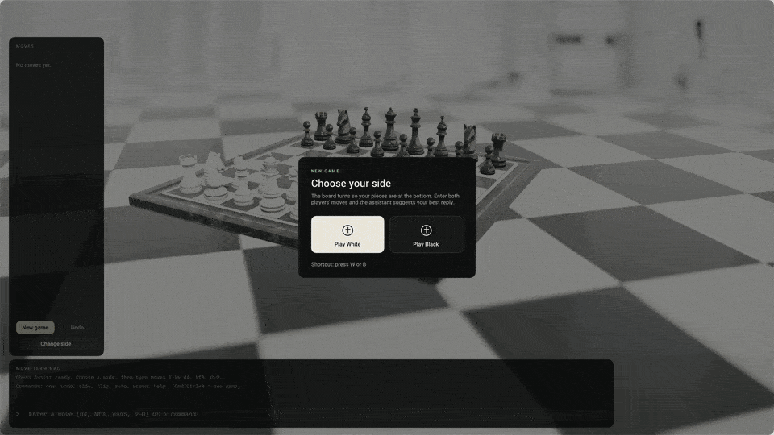
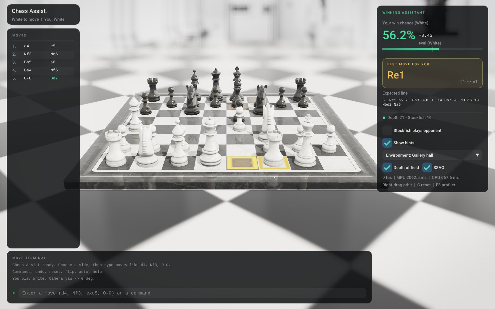
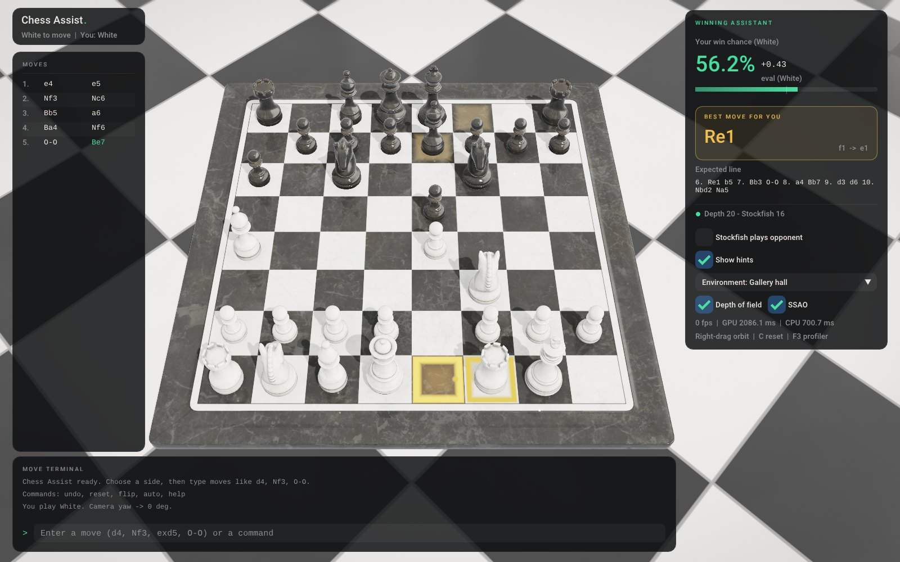
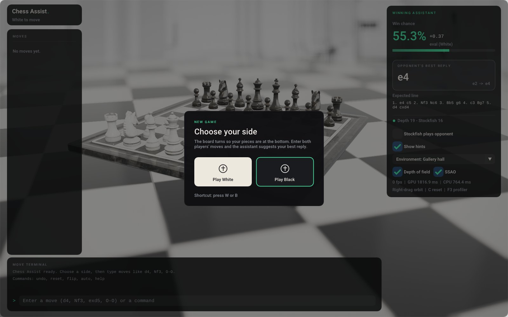
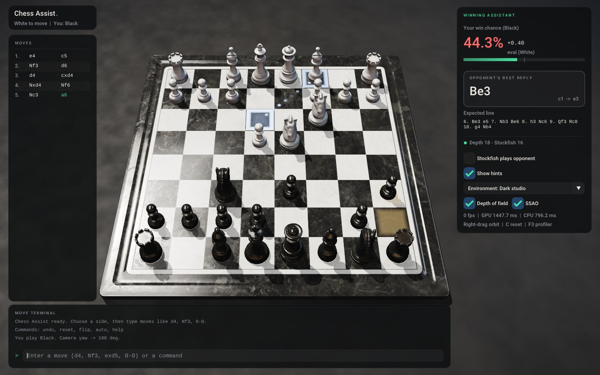
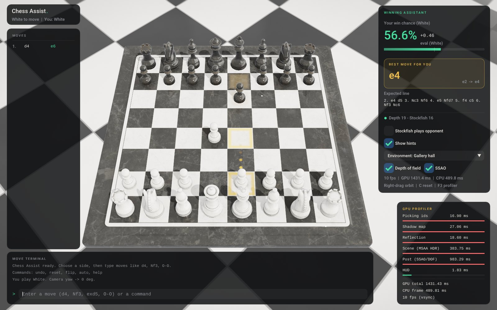

# Chess Assist

A 3D chess board with a live Stockfish "winning assistant", built in C++20 and
OpenGL 3.3 on top of the renderer from [ecyk/chess-3d](https://github.com/ecyk/chess-3d).

You pick a side, the camera turns so your pieces are at the bottom, and you
type the moves of a real game (yours and your opponent's) into a SAN terminal.
After every move Stockfish analyses the position on a background thread, and
the HUD shows your win probability, the evaluation and the best move. The
best move is also drawn on the 3D board as glowing squares and a dotted path.



▶ **15-second promo in 4K:** [MP4 (12 MB)](media/chess-assist-promo-4k.mp4) · [GIF (85 MB)](media/chess-assist-promo-4k.gif)



| Gameplay view | Side selection |
|---|---|
|  |  |
| **Dark studio scene, playing Black** | **GPU profiler (F3)** |
|  |  |

## Features

**Rendering** (`resources/shaders/pbr_shaders.glsl`, `post_fx.glsl`, `src/RenderPipeline.cpp`)
- Cook-Torrance GGX PBR with split-sum image-based lighting from analytic
  environments. The gallery hall has white walls, pilasters and window light;
  the photo studio has dark walls and bright softboxes.
- Lacquer clear-coat on the pieces and board, plus **planar mirror
  reflections** of the pieces in the board.
- 4096² directional **shadow map with PCF**: 16 rotated Poisson taps, each a
  hardware 2×2 comparison.
- **Ambient occlusion** in two parts: analytic contact AO under the pieces,
  and half-res **SSAO** with a depth-aware blur.
- **Depth of field**: a 40-tap golden-angle gather with firefly suppression.
- **Gallery environment**: a polished black/white marble floor laid on the
  diagonal (box-filtered, so it stays smooth at grazing angles). It dissolves
  into a photographic hall backdrop whose vanishing point is pinned to the 3D
  horizon. The backdrop pans as you orbit.
- HDR pipeline with 4× MSAA, ACES tone mapping, vignette and dithering grain.
- Eased world-space piece animation: knights jump, castling rooks slide,
  captured pieces sink away.

**Game workflow** (`include/BoardManager.h`)
- Launch opens on a slow orbit over the hall. You choose **White** or
  **Black**, and the camera rises to yaw **0°** or **180°**.
- **SAN terminal**: `d4`, `Nf3`, `exd5`, `O-O`, `e8=Q`, `Nbd2`, `R1e2`, plus
  UCI input (`e2e4`). Ambiguous moves get a hint ("could be Nbd2 or Nfd2").
- SAN is converted to exact LAN/UCI moves (`Nf3` → `g1f3`) and checked
  against the legal move generator. Move history is kept by turn:
  `1. d4 e6 2. c4 …`.
- You can also click to move.

**Winning Assistant** (`include/StockfishEngine.h`, `include/ProcessPipe.h`, `src/WinningAssistantHUD.cpp`)
- Stockfish runs as a child process connected over STDIN/STDOUT pipes on its
  own worker thread, so the render loop never waits on the engine.
- After every move it sends `position startpos moves …` and `go movetime N`.
  A newer position interrupts the running search with `stop`.
- The evaluation is shown live, converted to
  **WinProb = 1 / (1 + 10^(−eval/4))** (eval in pawns) from your side. The HUD
  also shows the best move, the principal variation and the search depth.
- Optional **"Stockfish plays opponent"** mode.

**Tooling**
- **GPU profiler** (F3): per-pass `GL_TIME_ELAPSED` timer queries, read a
  frame late so they never stall the GPU, shown next to CPU frame time. The
  mouse-picking pass only re-renders when something under the cursor can
  change.
- A loopback automation API and web console (`127.0.0.1:8765`) that mirror the
  HUD. Playwright drives the app through it. `--headless` runs the full logic
  and engine without a window.

## Build

### macOS

```sh
brew install cmake glfw glm stockfish
cmake -S . -B build -DCMAKE_BUILD_TYPE=Release
cmake --build build -j
./bin/chess-assist
```

### Linux

```sh
sudo apt install cmake libglfw3-dev libglm-dev stockfish
cmake -S . -B build -DCMAKE_BUILD_TYPE=Release && cmake --build build -j
./bin/chess-assist
```

If GLFW or GLM aren't installed, CMake fetches them. Dear ImGui, glad, stb and
cgltf are vendored in `external/`. To install a relocatable copy, run
`cmake --install build --prefix ~/opt/chess-assist`. That gives you
`bin/chess-assist` with `resources/` and `web/` next to it.

### Troubleshooting (macOS)

| Symptom | Fix |
|---|---|
| `fatal error: 'array' file not found` | Broken Command Line Tools: `sudo rm -rf /Library/Developer/CommandLineTools && xcode-select --install` |
| `tapi error: malformed file … unknown architecture arm64e.x1` | The newest SDK is ahead of your linker. Build against the previous one: `-DCMAKE_OSX_SYSROOT=/Library/Developer/CommandLineTools/SDKs/MacOSX26.sdk` (use whichever older SDK `ls /Library/Developer/CommandLineTools/SDKs` shows) |
| Wrong compiler picked up (conda / Homebrew LLVM) | `conda deactivate`, or pass `-DCMAKE_CXX_COMPILER=/usr/bin/clang++` |
| VS Code CMake Tools ignores the SDK flag | Add it to `"cmake.configureArgs"` in `.vscode/settings.json` |
| HUD says "Stockfish not found" | `brew install stockfish`, or `--stockfish /path/to/stockfish` |

## Usage

| Option | Meaning |
|---|---|
| `--side white\|black` | skip the side prompt |
| `--moves "d4 e6 c4"` | play moves on startup |
| `--scene gallery\|studio` | environment (default `gallery`) |
| `--pitch DEG` | starting camera pitch (lower shows more of the hall) |
| `--stockfish PATH` | engine binary (default: `$STOCKFISH_PATH`, Homebrew, apt paths, then `PATH`) |
| `--movetime MS` | engine time per position (default 1500) |
| `--port N` | automation console port (default 8765, `0` disables it) |
| `--headless` | no window: engine + automation API only |
| `--size 1600x1000` | window size |
| `--perf` | open the GPU profiler at start |
| `--screenshot out.png [--frames N]` | render, save a PNG, exit |
| `--version` | print the version |
| `--demo` | play the scripted 15 s showcase |
| `--record FILE --fps N --duration S` | write raw RGBA frames at a fixed timestep (see `tools/record_promo.sh`) |
| `--ui-scale S` | HUD scale for high-resolution captures |

| Input | Action |
|---|---|
| Type + Enter | play a move / run a command (↑/↓ recall history) |
| **New game** / **Undo** / **Change side** buttons | under the move list; Cmd/Ctrl+N also starts a new game (asks first if moves were played) |
| Left click | select a piece, click a highlighted square to move |
| Right/middle drag, scroll | orbit / zoom |
| `C` | return the camera to your side |
| `F3` | GPU profiler |
| `F11` | fullscreen |

Terminal commands: `new` (or `reset`), `undo`, `side` (choose a side again), `flip`, `white` / `black`, `auto`
(Stockfish plays the opponent), `hint`, `scene` (or `gallery` / `studio`),
`help`.

## Tests

```sh
ctest --test-dir build --output-on-failure       # C++ unit tests
npm install && npx playwright install chromium
npx playwright test                              # e2e against ./bin/chess-assist --headless
npm run test:e2e:windowed                        # same suite against the real 3D window
```

- **Unit tests** cover SAN↔LAN conversion, disambiguation, castling, en
  passant, promotion, history, camera flip, the win-probability formula, UCI
  `info` parsing, perft, and a live Stockfish round trip.
- **Playwright** (`tests/chess_app.spec.js`) checks:
  - the side prompt on launch
  - Black → 180° and White → 0° camera flips
  - `1. d4 e6` → `d2d4 e7e6`, with history and turn numbering
  - the assistant overlay updates after every move, with the win-probability formula and a legal recommendation
  - error messages for illegal and ambiguous input
  - in windowed mode, a PNG of the live 3D frame

GitHub Actions (`.github/workflows/ci.yml`) runs on every push and pull request:
- **Linux**: builds, runs the unit tests, runs the Playwright suite headless and against the windowed app (Mesa/Xvfb), and renders a still.
- **macOS**: builds, runs the unit tests and a headless API smoke test.

## Automation API

| Method | Path | Body |
|---|---|---|
| GET | `/` | web console |
| GET | `/api/state` | JSON: board, history, camera, assistant, perf |
| POST | `/api/side` | `{"side":"black"}` |
| POST | `/api/move` | `{"san":"Nf3"}` |
| POST | `/api/command` | `{"command":"undo"}` |
| POST | `/api/reset` | `{"clearSide":true}` |
| POST | `/api/autoplay` | `{"enabled":true}` |
| GET | `/api/screenshot.png` | live frame (windowed only) |

The server binds to `127.0.0.1` only. Start with `--port 0` to disable it.

## Project layout

```
include/ProcessPipe.h        child process + pipes (POSIX; Windows branch untested)
include/StockfishEngine.h    async UCI bridge on a worker thread
include/BoardManager.h       game state, side/camera flip, SAN <-> LAN, history
include/AssistantMath.h      win probability + eval formatting
include/GpuProfiler.h        per-pass GPU timer queries
src/WinningAssistantHUD.cpp  evaluation report + Dear ImGui HUD
src/RenderPipeline.cpp       shadow / reflection / MSAA HDR / SSAO / DOF passes
src/game.cpp                 app loop, animation, picking, commands
src/AutomationServer.cpp     loopback HTTP server for the console/API
resources/shaders/           pbr_shaders.glsl, post_fx.glsl, picking/outline
resources/textures/          gallery backdrop photo
web/console.html             automation console (Playwright target)
tests/                       C++ unit tests + Playwright suite
tools/record_promo.sh        renders the README promo (4K MP4 + GIF)
media/                       promo video
```

## Notes

- The rules engine comes from chess-3d. It detects checkmate and stalemate,
  but not the 50-move rule or threefold repetition. Stockfish still evaluates
  those positions correctly.
- The Windows code paths (`CreateProcess` pipes, Winsock) are written but not
  yet built in CI.
- Stockfish (GPL-3.0) isn't bundled. It runs as a separate program. See
  [THIRD_PARTY_NOTICES.md](THIRD_PARTY_NOTICES.md) for all licenses.

## License

MIT. See [LICENSE](LICENSE).
